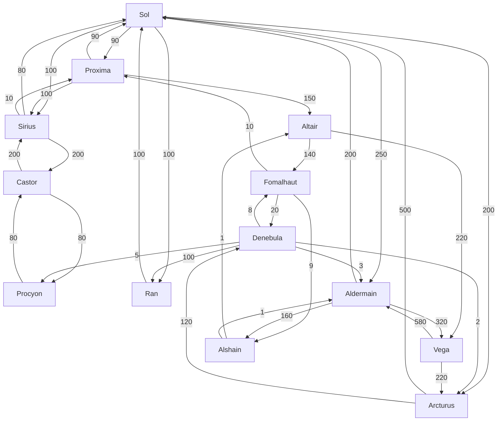

<h1 align="center">Technical Challenge - Interstellar Route Planner</h1>

# Brief
**Hyperspace Tunneling Corp** manages a system-to-system web of hyperspace gates that spans the United Terran Systems. They charge a fee to their users in order to use their network but they want to expand their business.

Recently, they've expanded into transporting people through their network using light transport space-ships that can take up to 5 people to the gate and then use their hyperspace-enabled ships to travel to the destination gate.

We've been asked to develop a system to help calculate the costs of this journey for their clients.

A journey is defined as:

1. Journey to the gate:
    * **Personal Transport**: £0.30/[AU](https://en.wikipedia.org/wiki/Astronomical_unit) (standard fuel cost) plus £5 per day for ship storage at the gate - (fits up to 4 people)
    * **HSTC Transport**: £0.45/[AU](https://en.wikipedia.org/wiki/Astronomical_unit) - (fits up to 5 people)

2. An outbound and an inbound hyperspace journey:
    * **Spaceflight**: £0.10/passenger/hyperplane-unit

> * [AU](https://en.wikipedia.org/wiki/Astronomical_unit) (Astronomical Unit) is roughly 149597870.7 Km - the average distance between the Earth and the Sun.
> * HU (Hyperplane Unit) is a fictional unit which measures the distance between two gates in the hyperplane - it has no correlation to real-space measurements.

HSTC keeps a table with its gates and their connections:

| Gate ID | Gate Name | Connections and Hyperplane units of distance (HU)                          |
| -------------- | ---------------- | -------------------------------------------------------------------------- |
| SOL            | Sol              | RAN: 100HU PRX: 90HU SIR: 100HU ARC: 200HU ALD: 250HU  |
| PRX            | Proxima          | SOL: 90HU SIR: 100HU ALT: 150HU                                |
| SIR            | Sirius           | SOL: 80HU PRX: 10HU CAS: 200HU                                 |
| CAS            | Castor           | SIR: 200HU PRO: 120HU                                              |
| PRO            | Procyon          | CAS: 80HU                                                              |
| DEN            | Denebula         | PRO: 5HU ARC: 2HU FOM: 8HU RAN: 100HU ALD: 3HU         |
| RAN            | Ran              | SOL: 100HU                                                             |
| ARC            | Arcturus         | SOL: 500HU DEN: 120HU                                              |
| FOM            | Fomalhaut        | PRX: 10HU DEN: 20HU ALS: 9HU                                   |
| ALT            | Altair           | FOM: 140HU VEG: 220HU                                              |
| VEG            | Vega             | ARC: 220HU ALD: 580HU                                              |
| ALD            | Aldermain        | SOL: 200HU ALS: 160HU VEG: 320HU                               |
| ALS            | Alshain          | ALT: 1HU ALD: 1HU                                                  |

Gates are typically one-way, so while the route `A->B` can exist, it doesn't necessarily mean that `B->A` exists. Additionally, the hyperplane distance varies depending on which way you travel - Our best theories say the hyperplane not only does not match real-space but also has a preferred direction.

## Gate Data
Feel free to use any form of storage for the gate and routes information.

You can make use of the SQL script [`create-local-postgres-db.sql`](./create-local-postgres-db.sql) to seed a postgres database.

## Your task:
Write a server that exposes an API that allows a user to calculate the cost of their journey:
* From wherever they are to the nearest gate
* From one gate to a destination gate

The API should expose, at least, the following endpoints:
* `GET`: `/transport/{distance}?passengers={number}&parking={days}` - returns the cheapest vehicle to use (and the cost of the journey) for the given `distance` (in AUs), `number` or passengers and `days` of parking (i.e. vehicle storage at the gate)
  * Gates typically sit above the star, so if you're on Earth and want to travel to the Sol gate, the distance would be ~1AU.
* `GET`: `/gates` - returns a list of gates with their information
* `GET`: `/gates/{gateCode}` - returns the details of a single gate
* `GET`: `/gates/{gateCode}/to/{targetGateCode}` - returns the cheapest route from `gateCode` to `targetGateCode`

These endpoints should be public.

### Expectations
* A link to the deployed API
* API documentation - e.g. Swagger, Postman collection
* Any diagrams, plans or notes you made while designing the solution
* A git repository with the solution
    * Application code
        * Use any programming language you like (unless stated otherwise)
    * Infrastructure config/code - e.g. Terraform
    * Tests
    * Any CI/CD configuration - e.g. github actions
    * Any supporting scripts to generate, package, run, etc...
* Instructions on how to run the application locally

# Getting help
If you have any questions, please feel free to reach out to me via email (tco@keyholding.com).

**This is a genuine offer for help** - I want to see you succeed! - and it lets me understand how you work and communicate.
